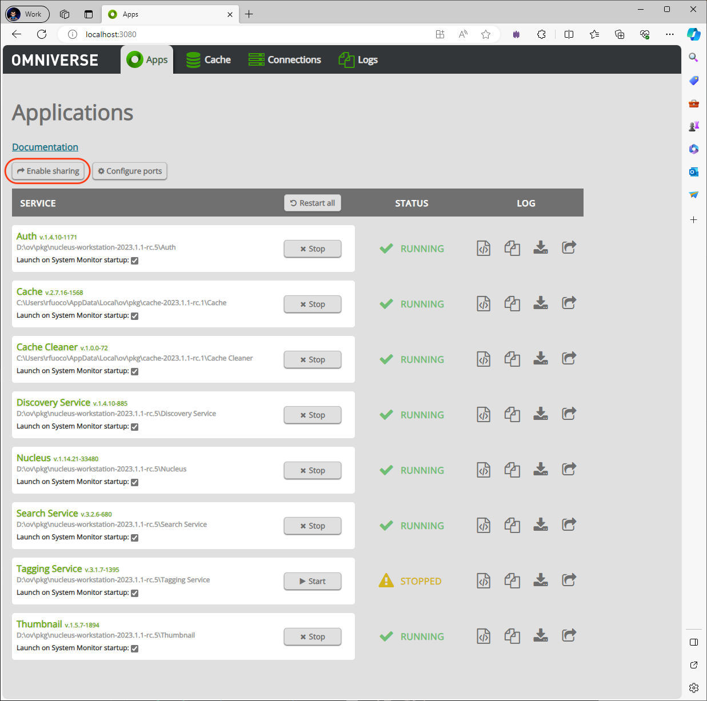
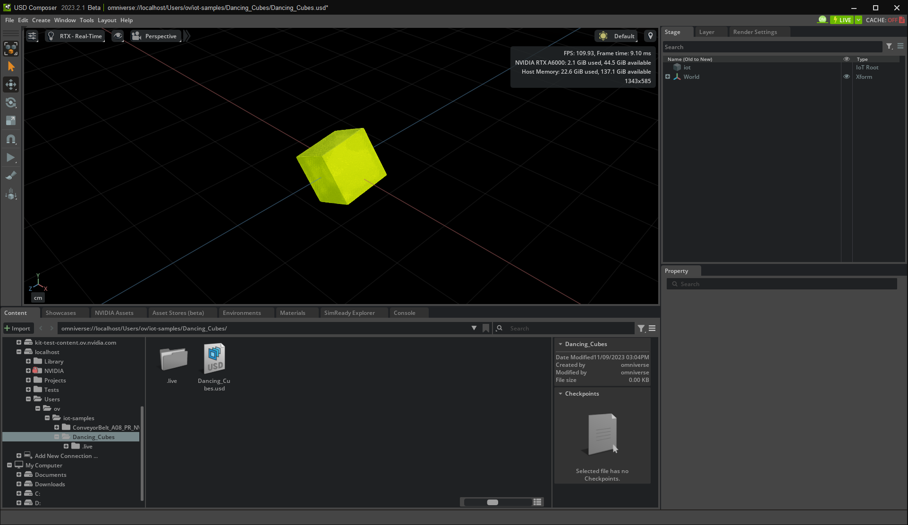
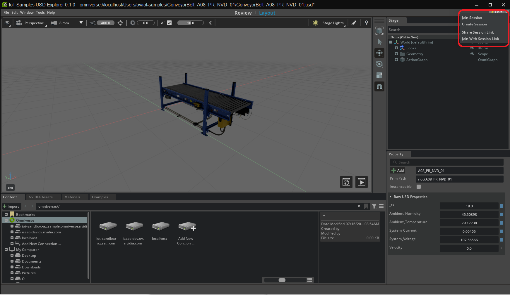
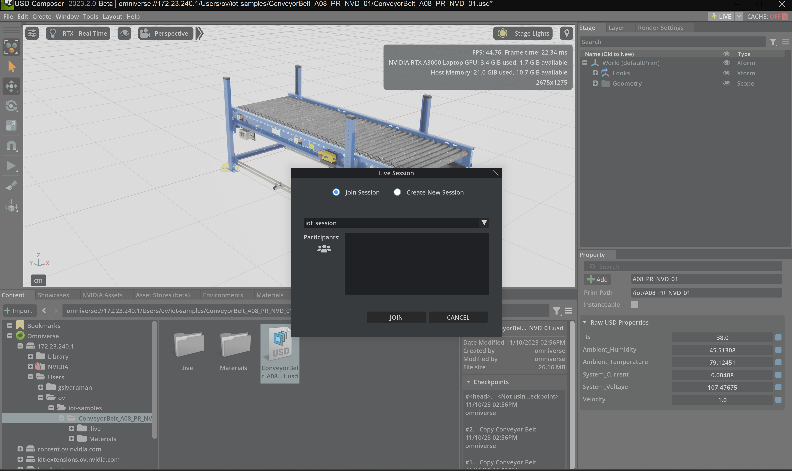
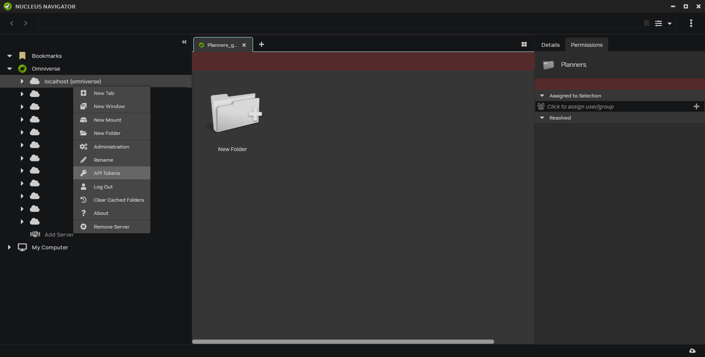
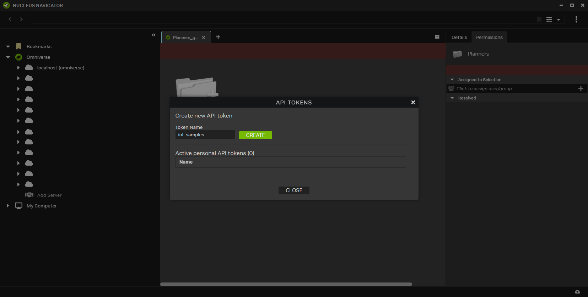

# IoT Samples (Beta)

# [Table of Contents](#tableofcontents)

- [Overview](#overview)
- [Architecture](#architecture)
- [Prerequisites](#prerequisites)
- [Installation](#installation)
    - [App Link Setup](#app-link-setup)
- [Headless Connector](#headless-connector)
    - [CSV Ingest Application](#csv-ingest-application)
    - [MQTT Ingest Application](#mqtt-ingest-application)
    - [Containerize Headless Connector](#containerize-headless-connector)
- [Consuming IoT data in USD](#consuming-iot-data-in-usd)
    - [Using an Extension](#using-an-extension)
    - [Using Action Graph](#using-actiongraph)
    - [Direct to USD from headless connector](#direct-to-usd-from-headless-connector)
- [Joining a Live Session](#joining-a-live-session)
- [API Key Authentication](#api-key-authentication)
- [Using Environment Variables](#using-environment-variables)

# Overview

Note: Before you clone the repo, ensure you have Git LFS installed and enabled. [Find out more about Git LFS](https://git-lfs.com/)

Developers can build their own IoT solutions for Omniverse by following the guidelines set out in these samples.

IoT Samples guides you on how-to:

- Connect IoT data sources (CSV, message broker etc.) to Omniverse
- Incorporate IoT data in the USD model
- Visualize IoT data, using an OmniUI extension
- Perform transformations of USD geometry using IoT data
- Incorporate Omniverse OmniGraph/ActionGraph with IoT data

## Repository Structure

| Directory Item   | Purpose                                                    |
|------------------|------------------------------------------------------------|
| .vscode          | VS Code configuration details and helper tasks             |
| content/         | Assets used by the samples                                 |
| readme-assets/   | Images and additional repository documentation             |
| source/          | Source code for the sample applications and extensions     |
| templates/       | Template Applications and Extensions.                      |
| tools/           | Tooling settings and repository specific (local) tools     |
| .dockerignore    | [docklerignore](https://docs.docker.com/build/building/context/#dockerignore-files) file.            |
| .editorconfig    | [EditorConfig](https://editorconfig.org/) file.            |
| .gitattributes   | Git configuration.                                         |
| .gitignore       | Git configuration.                                         |
| Dockerfile       | [Dockerfile](https://docs.docker.com/reference/dockerfile/)                                      |
| LICENSE          | License for the repo.                                      |
| README.md        | Project information.                                       |
| premake5.lua     | Build configuration - such as what apps to build.          |
| repo.bat         | Windows repo tool entry point.                             |
| repo.sh          | Linux repo tool entry point.                               |
| repo.toml        | Top level configuration of repo tools.                     |
| repo_tools.toml  | Setup of local, repository specific tools                  |
| tar_ignore.txt   | List of file to ignore when building the Docker image      |

When opening the `iot-samples` folder in Visual Studio Code, you will be promted to install a number of extensions that will enhance the python experience in Visual Studio Code.

# Architecture


The architecture decouples the IoT data model from the presentation in Omniverse, allowing for a data driven approach and separation of concerns that is similar to a [Model/View/Controller (MVC) design pattern](https://en.wikipedia.org/wiki/Model%E2%80%93view%E2%80%93controller). The diagram above illustrates the key components to a solution. These are:
- **Customer Domain** - represents the data sources. Industrial IoT deployments require connecting operational technology (OT) systems, such as SCADA, PLC, to information technology (IT) systems to enable various use cases to improve efficiency, productivity, and safety in various industries. These deployments provide a data ingestion endpoint to connect OT data to IT and cloud applications. Some of the widely adopted methods for connecting OT data include MQTT and Kafka. The samples in this repository use CSV and MQTT as data sources, but you can develop your IoT project with any other connectivity method.

- **Connector** - is a stand-alone application that implements a bidirectional bridge between customer domain and USD related data. The logic implemented by a connector is use-case dependent and can be simple or complex. The [CSV Ingest Application](#csv-ingest-application) and [MQTT Ingest Application](#mqtt-ingest-application) transits the data *as is* from source to destination, whereas the [Geometry Transformation Application](#direct-to-usd-from-headless-connector) manipulates USD geometry directly. Depending on the use cases, the connector can run as a headless application locally, on-prem, at the edge, or in the cloud.
    - **USD Resolver** - is a package dependency with the libraries for USD and Omniverse. [Find out more about the Omniverse USD Resolver](https://docs.omniverse.nvidia.com/kit/docs/usd_resolver/latest/index.html)
- **Nucleus** - is Omniverse's distributed file system agent that runs locally, in the cloud, or at the enterprise level. [Find out more about the Omniverse Nucleus](https://docs.omniverse.nvidia.com/nucleus/latest/index.html)
- **Consumer** - is an application that can manipulate and present the IoT data served by a Connector.
    - **USD Resolver** - is a package dependency with the libraries for USD and Omniverse.
    - **Fabric** -  is Omniverse's sub-system for scalable, realtime communication and update of the scene graph amongst software components, the CPU and GPU, and machines across the network. [Find out more about the Omniverse Fabric](https://docs.omniverse.nvidia.com/kit/docs/usdrt/latest/docs/usd_fabric_usdrt.html)
- **Controller** - implements application or presentation logic by manipulating the flow of data from the Connector.
    - **ActionGraph/OmniGraph** - is a visual scripting language that provides the ability to implement dynamic logic in response to changes made by the Connector. [Find out more about the OmniGraph Action Graph](https://docs.omniverse.nvidia.com/kit/docs/omni.graph.docs/latest/concepts/ActionGraph.html).
    - **Omniverse Extension** - is a building block within Omniverse for extending application functionality. Extensions can implement any logic required to meet an application's functional requirements. [Find out more about the Omniverse Extensions](https://docs.omniverse.nvidia.com/extensions/latest/overview.html).
    - **USD Stage** - is an organized hierarchy of prims (primitives) with properties. It provides a pipeline for composing and rendering the hierarchy. It is analogous to the Presentation Layer in MVC while additionally adapting to the data and runtime configuration.

Note: Connectors implement a producer/consumer pattern that is not mutually exclusive. Connectors are free to act as producer, consumer, or both. There may also be multiple Connectors and Consumers simultaneously collaborating.

# Prerequisites
Before running any of the installation a number of prerequisites are required.

Follow the [Getting Started with Omniverse ](https://www.nvidia.com/en-us/omniverse/download/) to install the latest Omniverse Launcher.

If you've already installed Omniverse Launcher, ensure you have updated to the latest

* Python 3.10 or greater
* Nucleus 2023.1 or greater

# Installation

Once you have the prerequisites installed, please run the following to install the needed Omniverse USD resolver, Omni client, and related dependencies.

### 1. Clone the Repository

Begin by cloning the `iot-samples` to your local workspace:

#### 1a. Clone

```bash
git clone https://github.com/NVIDIA-Omniverse/iot-samples
```

#### 1b. Navigate to Cloned Directory

```bash
cd iot-samples
```

### 2. Build the Omniverse Application

Build The application application with the following command:

**Linux:**
```bash
./repo.sh build
```
**Windows:**
```powershell
.\repo.bat build
 ```

 If you experience issues related to build, please see the [Usage and Troubleshooting](readme-assets/additional-docs/usage_and_troubleshooting.md) section for additional information.


### 3. Launch Omniverse

Start the application using:

**Linux:**
```bash
./repo.sh launch
```
**Windows:**
```powershell
.\repo.bat launch
```

**Select `iot_samples.usd_explorer.kit` with arrow keys and press enter**

***NOTE:* The initial startup may take 5 to 8 minutes as shaders compile for the first time. After initial shader compilation, startup time will reduce dramatically**

# Headless Connector

Headless connectos are stand-alone applications that implement a bidirectional bridge between customer domain and USD related data. The logic implemented by a connector is use-case dependent and can be simple or complex.

There are two sample connector applications - [CSV Ingest Application](#csv-ingest-application) and [MQTT Ingest Application](#mqtt-ingest-application) - that transits the data as is from source to destination, whereas the [Geometry Transformation Application](#direct-to-usd-from-headless-connector) manipulates USD geometry directly in the connector. Depending on the use cases, a connector can run as a headless application locally, on-prem, at the edge, or in the cloud.

### CSV Ingest Application

To execute the application run the following:
```bash
python source/ingest_app_csv/run_app.py
    -u <user name>
    -p <password>
    -s <nucleus server> (optional default: localhost)
```
Or if you are using Environment Variables (see [Using Environment Variables](#using-environment-variables))

```bash
python source/ingest_app_csv/run_app.py
```


Username and password are of the Nucleus instance (running on local workstation or on cloud) you will be connecting to for your IoT projects.

You should see output resembling:
```
2023-09-19 20:35:26+00:00
2023-09-19 20:35:28+00:00
2023-09-19 20:35:30+00:00
2023-09-19 20:35:32+00:00
2023-09-19 20:35:34+00:00
2023-09-19 20:35:36+00:00
2023-09-19 20:35:38+00:00
2023-09-19 20:35:40+00:00
2023-09-19 20:35:42+00:00
2023-09-19 20:35:44+00:00
```

The CSV ingest application can be found in the `./source/ingest_app_csv` folder. It will perform the following:
- Initialize the stage
    - Open a connection to Nucleus.
    - Copy `./content/ConveyorBelt_A08_PR_NVD_01` to `omniverse://<nucleus server>/users/<user name>/iot-samples/ConveyorBelt_A08_PR_NVD_01` if it does not already exist.Note that you can safely delete the destination folder in Nucleus and it will be recreated the next time the connector is run.
    - Create or join a Live Collaboration Session named `iot_session`.
    - Create a `prim` in the `.live` layer at path `/iot/A08_PR_NVD_01` and populate it with attributes that correspond to the unique field `Id` types in the CSV file `./content/A08_PR_NVD_01_iot_data.csv`.
- Playback in real-time
    - Open and parse `./content/A08_PR_NVD_01_iot_data.csv`, and group the contents by `TimeStamp`.
    - Loop through the data groupings.
    - Update the prim attribute corresponding to the field `Id`.
    - Sleep for the the duration of delta between the previous and current `TimeStamp`.


In your Omniverse application, open `omniverse://<nucleus server>/users/<user name>/iot-samples/ConveyorBelt_A08_PR_NVD_01/ConveyorBelt_A08_PR_NVD_01.usd` and join the `iot_session` live collaboration session. See [Joining a Live Session](#joining-a-live-session) for detailed instructions.

Once you have joined the `iot_session`, then you should see the following:


Selecting the `/iot/A08_PR_NVD_01` prim in the `Stage` panel and toggling the `Raw USD Properties` in the `Property` panel will provide real-time updates from the the data being pushed by the Python application.

### MQTT Ingest Application

To execute the application run the the following:

**Windows:**
```powershell
python source/ingest_app_mqtt/run_app.py
    -u <user name>
    -p <password>
    -s <nucleus server> (optional default: localhost)
```
Or if you are using Environment Variables (see [Using Environment Variables](#using-environment-variables))

**Windows:**
```powershell
python source/ingest_app_mqtt/run_app.py
```

Username and password are of the Nucleus instance (running on local workstation or on cloud) you will be connecting to for your IoT projects.

You should see output resembling:
```
Received `{
  "_ts": 176.0,
  "System_Current": 0.003981236,
  "System_Voltage": 107.4890366,
  "Ambient_Temperature": 79.17738342,
  "Ambient_Humidity": 45.49172211
  "Velocity": 1.0
}` from `iot/A08_PR_NVD_01` topic
2023-09-19 20:38:24+00:00
Received `{
  "_ts": 178.0,
  "System_Current": 0.003981236,
  "System_Voltage": 107.4890366,
  "Ambient_Temperature": 79.17738342,
  "Ambient_Humidity": 45.49172211
  "Velocity": 1.0
}` from `iot/A08_PR_NVD_01` topic
2023-09-19 20:38:26+00:00
```


The MQTT ingest application can be found in the `./source/ingest_app_mqtt` folder. It will perform the following:
- Initialize the stage
    - Open a connection to Nucleus.
    - Copy `./content/ConveyorBelt_A08_PR_NVD_01` to `omniverse://<nucleus server>/users/<user name>/iot-samples/ConveyorBelt_A08_PR_NVD_01` if it does not already exist. Note that you can safely delete the destination folder in Nucleus and it will be recreated the next time the connector is run.
    - Create or join a Live Collaboration Session named `iot_session`.
    - Create a `prim` in the `.live` layer at path `/iot/A08_PR_NVD_01` and populate it with attributes that correspond to the unique field `Id` types in the CSV file `./content/A08_PR_NVD_01_iot_data.csv`.
- Playback in real-time
    - Connect to MQTT and subscribe to MQTT topic `iot/{A08_PR_NVD_01}`
    - Dispatch data to MQTT
        - Open and parse `./content/A08_PR_NVD_01_iot_data.csv`, and group the contents by `TimeStamp`.
        - Loop through the data groupings.
        - Publish data to the MQTT topic.
        - Sleep for the the duration of delta between the previous and current `TimeStamp`.
    - Consume MQTT data
        - Update the prim attribute corresponding to the field `Id`.


In your Omniverse application, open `omniverse://<nucleus server>/users/<user name>/iot-samples/ConveyorBelt_A08_PR_NVD_01/ConveyorBelt_A08_PR_NVD_01.usd` and join the `iot_session` live collaboration session. See [Joining a Live Session](#joining-a-live-session) for detailed instructions.

Once you have joined the `iot_session`, then you should see the following:


Selecting the `/iot/A08_PR_NVD_01` prim in the `Stage` panel and toggling the `Raw USD Properties` in the `Property` panel will provide real-time updates from the data being pushed by the python application

### Containerized headless connector
The following is a simple example of how to deploy a headless connector application into Docker Desktop for Windows. Steps assume the use of

- WSL (comes standard with Docker Desktop installation) and
- Ubuntu Linux as the default OS.

The ollowing has to be done in **WSL environment** and *NOT* in Windows environment. Make sure you are in WSL, else you may encounter build and dependency errors.

- If you have an earlier version of the repo cloned, you may want to delete the old repo in WSL and start with a new cloned repo in WSL. Else you could end up with file mismatches and related errors.

- Before you clone the repo, ensure you have Git LFS installed and enabled. [Find out more about Git LFS](https://git-lfs.com/)

- Clone a new repo from **within WSL**

Once you have a new repo cloned, from within WSL run.

**Linux:**
```bash
./repo.sh build
```

- Share the Nucleus services using a web browser by navigating to http://localhost:3080/. Click on 'Enable Sharing'. This will enable access to  Nucleus services from WSL.

    

- Record the *WSL IP address* of the host machine for use by the container application.
    ```
    PS C:\> ipconfig

    Windows IP Configuration

    ...

    Ethernet adapter vEthernet (WSL):

    Connection-specific DNS Suffix  . :
    Link-local IPv6 Address . . . . . : fe80::8026:14db:524d:796f%63
    IPv4 Address. . . . . . . . . . . : 172.21.208.1
    Subnet Mask . . . . . . . . . . . : 255.255.240.0
    Default Gateway . . . . . . . . . :

    ...
    ```
- Open a Bash prompt in **WSL** and navigate to the source repo and launch Visual Studio Code (example: `~/github/iot-samples/`). Make sure you're launching the Visual Studio Code from **WSL environment** and *not* editing the DockerFile from within Windows
    ```bash
    code .
    ```
- Modify the DockerFile `ENTRYPOINT` to add the WSL IP address to connect to the Host's Nucleus Server. Also, include the username and password for your Omniverse Nucleus instance.

    ```docker
    # For more information, please refer to https://aka.ms/vscode-docker-python
    FROM python:3.10-slim

    # Keeps Python from generating .pyc files in the container
    ENV PYTHONDONTWRITEBYTECODE=1

    # Turns off buffering for easier container logging
    ENV PYTHONUNBUFFERED=1

    WORKDIR /app
    COPY . /app

    # Creates a non-root user with an explicit UID and adds permission to access the /app folder
    # For more info, please refer to https://aka.ms/vscode-docker-python-configure-containers
    RUN adduser -u 5678 --disabled-password --gecos "" appuser && chown -R appuser /app
    USER appuser

    # During debugging, this entry point will be overridden. For more information, please refer to https://aka.ms/vscode-docker-python-debug
    ENTRYPOINT [ "python", "source/ingest_app_csv/run_app.py", "--server", "<host IP address>", "--username", "<username>", "--password", "<password>"  ]

    ```
- Create a docker image named `headlessapp`.

    **Linux:**
    ```bash
    tar -czh -X tar_ignore.txt . | docker build -t headlessapp -
    ```
- Run a container with the lastest version of the `headlessapp` image

    **Windows:**
    ```powershell
    docker run -d --add-host host.docker.internal:host-gateway -p 3100:3100 -p 8891:8891 -p 8892:8892  headlessapp:latest
    ```
- Watch the application run in Docker Desktop.

    


# Consuming IoT data in USD

Consume the IoT data served by a connector by building your own application logic to visualize, animate and transform with USD stage. The application logic could use one of the following approaches or all of them;

- Extension
- Action Graph
- Direct to USD from headless connector

### Using an Extension

The sample IoT Extension uses Omniverse Extensions, which are the core building blocks of Omniverse Kit-based applications.

The IoT Extension demonstrates;

- Visualizing IoT data
- Animating a USD stage using IoT data


**Visualizing IoT data**

The IoT Extension leverages the Omniverse UI Framework to visualize the IoT data as a panel. [Find out more about the Omniverse UI Framework](https://docs.omniverse.nvidia.com/kit/docs/omni.ui/latest/Overview.html)

1. **Launch Omniverse**

Start the application using:

**Linux:**
```bash
./repo.sh launch
```
**Windows:**
```powershell
.\repo.bat launch
```

**Select `iot_samples.panel_extension.kit` with arrow keys and press enter**

***NOTE:* The initial startup may take 5 to 8 minutes as shaders compile for the first time. After initial shader compilation, startup time will reduce dramatically**

2. **Load the staage**

In your Omniverse application,

open `omniverse://<nucleus server>/users/<user name>/iot-samples/ConveyorBelt_A08_PR_NVD_01/ConveyorBelt_A08_PR_NVD_01.usd`.

3. **Join the IoT Live session**

See [Joining a Live Session](#joining-a-live-session)

4. **Select the Iot Topic**


Click on the `play` icon on the bottom right of the applications's viewport and then start the timeline. The extension will animate to the `Velocity` value change in the IoT data


and then run one of the following:

**Windows:**
```powershell
source\ingest_app_csv\run_app.py
    -u <user name>
    -p <password>
    -s <nucleus server> (optional default: localhost)
```
 or

**Windows:**
```powershell
source\ingest_app_mqtt\run_app.py
    -u <user name>
    -p <password>
    -s <nucleus server> (optional default: localhost)
```

If you are using Environment Variables (see [Using Environment Variables](#using-environment-variables)) then run one of the following:

**Windows:**
```powershell
python source/ingest_app_csv/run_app.py
```
or

**Windows:**
```powershell
python source/ingest_app_mqtt/run_app.py
```

Username and password are for the target Nucleus instance (running on local workstation or on cloud) that you will be connecting to for your IoT projects.

 You will see the following animation with the cube moving:


When the IoT velocity value changes, the extension will animate the rollers (`LiveRoller` class) as well as the cube (`LiveCube` class).


### Using ActionGraph

The `ConveyorBelt_A08_PR_NVD_01.usd` contains a simple `ActionGraph` that reads, formats, and displays an attribute from the IoT prim in the ViewPort (see [Omniverse Extensions Viewport](https://docs.omniverse.nvidia.com/extensions/latest/ext_viewport.html)).

To access the graph:
- Select the `Window/Visual Scripting/Action Graph` menu
- Select `Edit Action Graph`
- Select `/World/ActionGraph`

You should see the following:


The Graph performs the following:
- Reads the `_ts` attribute from the `/iot/A08_PR_NVD_01` prim.
- Converts the numerical value to a string.
- Prepends the string with `TimeStamp: `.
- Displays the result on the ViewPort.


### Direct to USD from Headless Connector

Sample demonstrates how to execute USD tranformations from a headless connector using arbtriary values.

To execute the application run the the following:

**Windows:**
```powershell
python source/transform_geometry/run_app.py
    -u <user name>
    -p <password>
    -s <nucleus server> (optional default: localhost)
```
Username and password are of the Nucleus instance (running on local workstation or on cloud) you will be connecting to for your IoT projects.

The sample geometry transformation application can be found in `source\transform_geometry`. It will perform the following:
- Initialize the stage
    - Open a connection to Nucleus.
    - Open or Create the USD stage `omniverse://<nucleus server>/users/<user name>/iot-samples/Dancing_Cubes.usd`.
    - Create or join a Live Collaboration Session named `iot_session`.
    - Create a `prim` in the `.live` layer at path `/World`.
    - Create a `Cube` at path `/World/cube`.
        - Add a `Rotation`.
    - Create a `Mesh` at path `/World/cube/mesh`.
- Playback in real-time
    - Loop for 20 seconds at 30 frames per second.
    - Randomly rotate the `Cube` along the X, Y, and Z planes.


If you open `omniverse://<nucleus server>/users/<user name>/iot-samples/Dancing_Cubes.usd` in `Composer` or `Kit`, you should see the following:



# Joining A Live Session

Here's how-to join a live collaboration session. Click on `Join Session`



Select `iot-session` from the drop down to join the already created live session.



# API Key Authentication
To authenicate the connector application using an API Key, start Nucleus Explore from the Omniverse Launcher application and right click on the server you wish to connect to and select `API Tokens`



Provide a token name and click `Create`



Copy the token token value and store it somewhere safe.

If you are using the `run_app.py` application launcher you can do the following:

**Windows:**
```powershell
python source/ingest_app_csv/run_app.py
    -u $omni-api-token
    -p <api token>
    -s <nucleus server> (optional default: localhost)
```

Or if you are using Environment Variables (see [Using Environment Variables](#using-environment-variables)) you can do the following:

**Windows:**
```powershell
python source/ingest_app_csv/run_app.py
```

# Using Environment Variables

The samples supports Nucleus authentication via Environment Variables.

Set User Name and Password environment variables:

**Linux:**
```bash
export OMNI_HOST=<host name>
export OMNI_USER=<user name>
export OMNI_PASS=<password>
```

**Windows:**
```powershell
$Env:OMNI_HOST = "<host name>"
$Env:OMNI_USER = "<user name>"
$Env:OMNI_PASS = "<password>"
```

Set the API Token environment variable:

**Linux:**
```bash
export OMNI_HOST=<host name>
export OMNI_USER=\$omni-api-token
export OMNI_PASS=<API Token>
```

**Windows:**
```powershell
$Env:OMNI_HOST = "<host name>"
$Env:OMNI_USER = "`$omni-api-token"
$Env:OMNI_PASS = "<API Token>"
```

## License

Development using the Omniverse Kit SDK is subject to the licensing terms detailed [here](https://docs.omniverse.nvidia.com/dev-guide/latest/common/NVIDIA_Omniverse_License_Agreement.html).

## Data Collection
The Omniverse Kit SDK collects anonymous usage data to help improve software performance and aid in diagnostic purposes. Rest assured, no personal information such as user email, name or any other field is collected.

To learn more about what data is collected, how we use it and how you can change the data collection setting [see details page](readme-assets/additional-docs/data_collection_and_use.md).

## Additional Resources

- [Kit App Template Companion Tutorial](https://docs.omniverse.nvidia.com/kit/docs/kit-app-template/latest/docs/intro.html)

- [Usage and Troubleshooting](readme-assets/additional-docs/usage_and_troubleshooting.md)

- [BETA - Developer Bundle Extensions](readme-assets/additional-docs/developer_bundle_extensions.md)

- [Omniverse Kit SDK Manual](https://docs.omniverse.nvidia.com/kit/docs/kit-manual/latest/index.html)


## Contributing

We provide this source code as-is and are currently not accepting outside contributions.